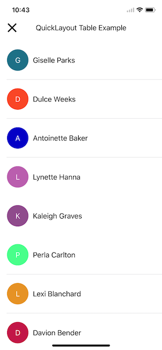

# QuickLayout

[](https://developer.apple.com/iphone/index.action)
[](https://developer.apple.com/swift)
[](http://mit-license.org)

Harness the power of QuickLayout to align your interface programmatically, without using the Interface Builder.
QuickLayout offers you a simple and easy way to assign and manage constraints via code.




## Example
The example project (xib/storyboard free) demonstrates the power of pragrammatic constraints with QuickLayout using several use cases.
To run the example project, clone the repo, and run `pod install` from the Example directory first.

## Requirements
Swift 4.0 and iOS 9.0 (or higher).

## Usage of `UIView+QuickLayout`

Simple use case:

    // Create a view and add it to the view hierarchy
    let simpleView = UIView()
    simpleView.backgroundColor = .gray
    view.addSubview(simpleView)
    
    // Set constant height
    simpleView.setConstant(.height, value: 50)
    
    // Make simpleView cling to the top of it's superview
    simpleView.layoutToSuperview(.top)
    
    // Make simpleView cling to the center of it's superview
    simpleView.layoutToSuperview(.centerX)
    
    // Make simpleView get 80% of the width of it's superview
    simpleView.layoutToSuperview(.width, multiplier: 0.8)

Example for retrieving back constraint after setting it (Method's result is discardable, but you can access the constraint value after using invoking it):

    let constraint = simpleView.layoutToSuperview(.centerX)

Center simpleView in superview, and retrieve the x, y constraints in `QLCenterConstraints` object:

    let center = simpleView.centerInSuperview()
    
    // Move simpleView 20 dots down and right using x property of `QLCenterConstraints`
    center?.x.constant = 20
    center?.y.constant = 20

Size simpleView to it's superview, and retrieve the constraints in `QLSizeConstraints` object:

    let size = simpleView.sizeToSuperview()
    
    // Access width and height constraints easily
    size?.width.constant = -20
    
Make simpleView totally fill superview, and retrieve all constraints via `QLFillConstraints`:

    let constraints = simpleView.fillSuperview()
    
You can layout view in relation to another view, and optionally set constant distance between them:

    simpleView.layout(.left, to: .right, of: anotherView, constant: 20)

Use variatic parameter to easiliy install constraints for `simpleView`, simultaniouly.
    
    simpleView.layoutToSuperview(edges: .top, .bottom, .left, .right)

## Installation
    
#### CocoaPods
```
pod 'QuickLayout', :git => 'https://github.com/huri000/QuickLayout', :tag => '0.2.1'
```

#### Manually
Add the source files to your project.

## Contributing
Forks, patches and other feedback are welcome.

## Author
Daniel Huri (huri000@gmail.com)

## License

QuickLayout is available under the MIT license. See the LICENSE file for more info.
